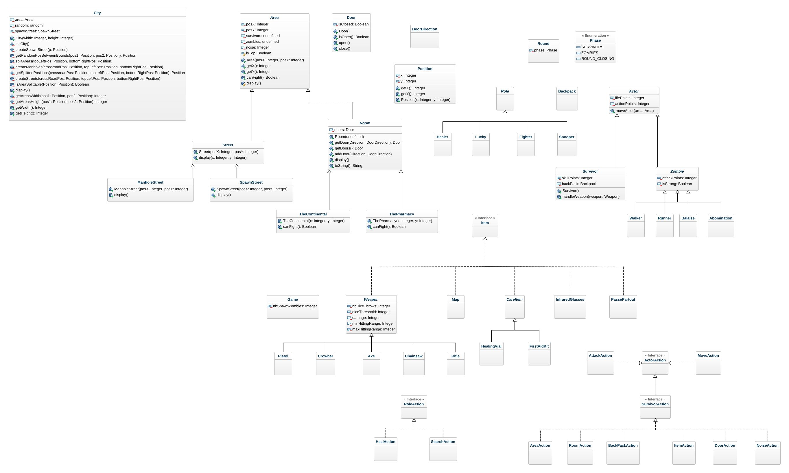

# l2s4-projet-2024

# Equipe

- Léo GIARDINELLI
- Théophane LEGRAND
- Dylan LEMAIRE
- Elies PLACIDE

# Sujet

[Le sujet 2024](https://www.fil.univ-lille.fr/~varre/portail/l2s4-projet/sujet2024.pdf)

# UML

# Livrables

## Livrable 1

### Atteinte des objectifs

### Difficultés restant à résoudre

## Livrable 2

### Atteinte des objectifs

### Difficultés restant à résoudre

## Livrable 3

### Atteinte des objectifs

### Difficultés restant à résoudre

## Livrable 4

### Atteinte des objectifs

### Difficultés restant à résoudre

# Journal de bord

## Semaine 1
Together, we created our first version of the UML with all the classes and the first methods and attributes.  
Then, over the next few days, we completed it and divided up the various classes to be coded.  
Léo -> Area.java  
Dylan -> Door.java  
Elies -> City.java  
Théophane -> Building.java  

## Semaine 2
__Objectif de la semaine : __ 
- Finir l'algorythme de création de la map
- Avancer sur la modélisation de la map

__Réflexion du groupe :  __
Durant la semaine, nous nous sommes posé plusieurs question, par exemple comment split la map pour créer les immeubles et comment le modéliser pour faire en sorte que quand une porte est cassé, supprimer dans l'affichage que cette porte.  
Nous avons premièrement écrit un algorithme non récursif puis avec de la récursivité mais celui-ci ne fonctionne pas car il split que 1 fois.  

__Partage de taches : __  

## Semaine 3
__Objectif de la semaine :__  
- Finir la modélisation des portes
- Terminer la modélisation de la map
- Finir l'affichage de la map
- Finir les tests

__Objectif atteint :__
- Finir la modélisation des portes
- Finir les tests
 

__Réflexion du groupe :__  

Lundi 29/01 :
Durant ce lundi, nous avons réfléchi à la modélisation des portes, ce qui nous a amenés à la création d'une classe enum pour la position des portes avec l'ajout d'une hashmap enum/porte.

Cela nous a également amenés à réfléchir sur l'affichage de la map et l'affichage des portes (ouvertes et fermées), et nous avons réfléchi sur la méthode de splitHorizontal et splitVertical en la modifiant sur un split en croix.

Les jours suivants :
Nous avons réfléchi à si nous allions faire des méthodes de tests sur city et après plusieurs réfléxion sur l'utilité dans faire du fait que nous avions mis les méthodes en privée, nous n'avons pas fait de méthode de test pour city.

Vendredi 02/02 :
Après une réflexion de groupe à 4, nous avons décidé de revenir sur une version antérieure de City car la nouvelle version ne convenait pas par rapport à nos objectifs.

Week-end :
Pour pouvoir gerer les portes ouvertes, nous avons penser à regarder la cellulle du dessus pour savoir si la porte du bas était ouverte ou non, de même pour les autres côté. Le problème que nous avons eu est que si la celulle d'au dessus est une street, elle n'a pas de porte. 
En refléchissant en groupe, nous avons utilisé la solution de faire en sorte qu'une porte soit la même pour les pièces mitoyenne.
En créant cette méthode, nous l'avons testé et elle fonctionne bien, le problème étant que le code n'est très explicite, nous allons essayer de le simplifier.
Les portes sont crées comme voulues dans chaque zone, il faut règler l'affichage de ces dernières dans le cas ou la zone est une rue.
Le problème actuellement esEquipementt de pouvoir gerer l'affichage dans le cas où entre les street il n'y a pas de porte car comment savoir que deux streets sont a côté.

__Partage de taches :__

Lundi 29/01 :
- Groupe entier -> réunion des idées et réflexion sur la modélisation de la map et l'affichage des pièces et des portes.
- Dylan -> Terminer la modélisation de la map
- Elies -> Finir l'affichage de la map
- Théophane -> Mise en place et mise en forme du readme
- Léo -> Terminer la modélisation de la map

Les jours suivants :
    
- Dylan -> affichage des rues, finalisation des splits, affichage des portes et de leur état 
- Elies -> création de la méthode display, initialisation des rooms et ajout des portes
- Théophane -> Finir les tests
- Léo -> création des deux classes continentale et pharmacie + intégration des deux classes dans la ville

Mardi 30/01 :
    
- Elies -> test de la création display en initialisant des Room (sans méthode de split précise). Pour cela, j'ai amélioré la classe Room pour permettre l'ajout de portes 
   
Mercredi 31/01 :
    
- Dylan -> création de la logique de split terminée, plateau prêt à être utilisé notamment pour l'affichage des portes en fonction de leur état. Javadoc de la classe City mise à jour.

- Théophane -> Création des tests concernant la classe Room et la classe Door, les tests sont terminés concernant ces deux classes, suppréssion de la classe test street après réflexion sur son utilité, amélioration des méthodes de tests dans la classe test Area et réfléxion sur différentes methodes à revoirs

Jeudi 01/02 :

- Léo : Création des classes continental et pharmacie et début de code dans celle-ci.

- Théophane : Ajout de méthode canFight dans la pharmacie et le continental, test sur la pharmacie et le continental dans la class test area 

Vendredi 02/02 :

- Théophane : Modification des tests -> implémentation des beforeEach et ajout, modification de test 
- Léo : coder la méthode display pour avoir un affichage que l'oint souhaite, non fini.

Week-end :
- Léo, Dylan : Amelioration du display, travail à deux sur un seul écran.
- Dylan : Crééation des portes dans chaque zones, en prenant en compte le fait qu'une porte peut être dans deux pièces.
- Théophane, Elies : Mis à jour de l'UML en fonction des modifications qui ont été faites et completer le readme. 

## Semaine 4

__Objectif de la semaine :__  

__Objectif atteint :__

__Réflexion du groupe :__  

Lundi 05/02 :
- Léo, Dylan : Amelioration du display pour gerer les portes entre les streets et début de modification de code pour ajouter des constantes dans le but d'ameliorer le code si modification.

Les jours suivants :

Vendredi 02/02 :

Week-end :

__Partage de taches :__

Lundi 05/02 : 
- Eliès : création des classes liées aux survivants (Survivor, types de survivants). Ajout des classes BackPack et Role.

Les jours suivants :
    
Mardi 30/01 :

Mercredi 31/01 :
 
Jeudi 01/02 :

Vendredi 02/02 :

Week-end :

## Semaine 5

## Semaine 6

## Semaine 7

## Semaine 8

## Semaine 9

## Semaine 10

## Semaine 11

## Semaine 12
